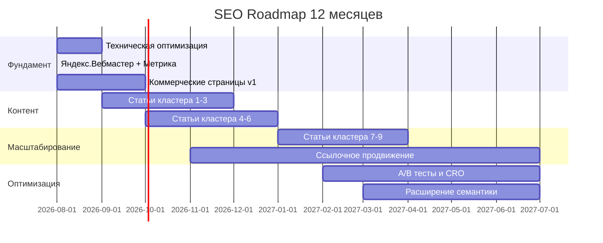

# SEO Master Plan — DimaRazrab.com

> Генеральный документ-навигатор по SEO-стратегии портфолио-сайта фриланс-разработчика.
> Дата создания: Август 2026
> Целевой рынок: Россия (Яндекс)
> Сайт: https://dima-razrab.com

---

## 1. Миссия и цели SEO-стратегии

### Главная цель
Перевести сайт с текущего состояния 1-2 заказов через сарафан на стабильный поток 8-15 заявок/месяц из органического поиска Яндекса в течение 12 месяцев.

### Конкретные цели

| Цель | Текущее | Целевое 12 мес | Целевое 18 мес |
|------|---------|----------------|----------------|
| Органический трафик/мес | ~50-100 визитов | 400-800 | 800-1500 |
| Заявки из органики/мес | 0-1 | 3-8 | 8-15 |
| Клиенты из органики/мес | 0 | 1-3 | 3-5 |
| Проиндексированных страниц | ~20 | 80-120 | 150-200 |
| Позиции в Яндексе (ключевые запросы) | Не в топ-50 | Топ-10 по НЧ | Топ-5 по НЧ, топ-10 по СЧ |

---

## 2. Текущее состояние сайта

### Техническая база
- **Платформа:** Next.js (Pages Router)
- **Домен:** dima-razrab.com
- **Хостинг:** VPS с FastAPI бэкендом (localhost:8000)

### Что уже есть

**Коммерческие страницы (4 штуки):**
| Страница | URL | Статус |
|----------|-----|--------|
| Разработка ботов | `/razrabotka-botov` | Есть, детальный лендинг |
| Разработка сервисов | `/razrabotka-servisov` | Есть |
| Разработка CRM | `/razrabotka-crm` | Есть |
| Автоматизация бизнеса | `/avtomatizaciya-biznesa` | Есть, детальный лендинг |

**Блог — 2 кластера, 20 статей:**
| Кластер | Кол-во статей | Hub-страница |
|---------|---------------|-------------|
| Telegram-боты | 15 статей | `/blog/telegram-boty` |
| Автоматизация бизнеса | 5 статей | `/blog/avtomatizaciya-biznesа` |

**Техническое:**
- Schema.org (Article + FAQPage + BreadcrumbList) — настроено
- Meta теги, OG, canonical — настроено
- Sitemap — статический файл в `plans/sitemap.xml`, НЕ динамический
- robots.txt — **ОТСУТСТВУЕТ**
- Динамическая генерация sitemap — **ОТСУТСТВУЕТ**
- Яндекс.Вебмастер — не настроен (предположительно)
- Яндекс.Метрика — не настроен (предположительно)

### Что критически отсутствует
1. robots.txt
2. Динамический sitemap.xml
3. Коммерческие страницы для новых направлений (парсинг, лидогенерация, Python, Next.js, AI, API)
4. Статьи по новым кластерам
5. Контекстные внутренние ссылки между статьями
6. Яндекс.Вебмастер и Метрика

---

## 3. Приоритетность направлений


| # | Направление | Приоритет | Обоснование |
|---|-------------|-----------|-------------|
| 1 | Telegram-боты | ★★★ | Любимое направление, уже есть контент, быстрая реализация |
| 2 | Парсинг маркетплейсов | ★★★ | Высокий спрос, мало конкурентов, высокий средний чек |
| 3 | Лидогенерация Telegram | ★★★ | Новая ниша, мало конкурентов, высокая маржа |
| 4 | Автоматизация бизнеса | ★★ | Уже есть контент, средняя конкуренция |
| 5 | Python-разработка | ★★ | Стабильный спрос, техническая аудитория |
| 6 | Next.js разработка | ★ | Средний спрос, высокая конкуренция |
| 7 | AI-интеграции | ★ | Растущий спрос, но ранний рынок |
| 8 | Разработка API | ★ | Стабильный НЧ спрос |
| 9 | Веб-разработка общее | ★ | Высокая конкуренция, низкая конверсия |

---

## 4. KPI и метрики

### Основные KPI

| KPI | Источник | Частота проверки |
|-----|----------|-----------------|
| Органический трафик | Яндекс.Метрика | Еженедельно |
| Позиции по ключевым запросам | Яндекс.Вебмастер / Keys.so | Еженедельно |
| Количество заявок | CRM / форма на сайте | Ежедневно |
| Конверсия трафика → заявка | Яндекс.Метрика | Ежемесячно |
| Количество проиндексированных страниц | Яндекс.Вебмастер | Еженедельно |
| Core Web Vitals | PageSpeed Insights | Ежемесячно |
| Количество обратных ссылок | Ahrefs / Megaindex | Ежемесячно |

### Воронка SEO → Клиент

```
Показ в Яндексе → Клик на сайт → Просмотр страницы → Заявка → Клиент
   100%              3-8%           60-80%           1.5-3%    10-20%
```

---

## 5. Обзор документов в папке PLAN_SEO

| # | Документ | Описание | Статус |
|---|----------|----------|--------|
| 00 | [MASTER-PLAN.md](./00-MASTER-PLAN.md) | Этот файл — навигатор по всей стратегии | Текущий |
| 01 | [SEMANTIC-CORE.md](./01-SEMANTIC-CORE.md) | Полное семантическое ядро 615+ запросов по 9 кластерам | Создан |
| 02 | [PAGE-PLAN.md](./02-PAGE-PLAN.md) | План коммерческих и информационных страниц | Создан |
| 03 | [ECONOMIC-MODEL.md](./03-ECONOMIC-MODEL.md) | Экономическая модель: 3 сценария роста | Создан |
| 04 | [ROADMAP.md](./04-ROADMAP.md) | Дорожная карта на 12 месяцев | Создан |
| 05 | [TECHNICAL-SEO.md](./05-TECHNICAL-SEO.md) | Чеклист технической оптимизации Next.js | Создан |
| 06 | [CONTENT-GUIDE.md](./06-CONTENT-GUIDE.md) | Гайд по написанию SEO-статей | Создан |

---

## 6. Дорожная карта (краткая)



### Фаза 1: Фундамент (месяцы 1-2)
- Техническая оптимизация (sitemap, robots.txt, мета-теги, скорость)
- Настройка Яндекс.Вебмастер и Метрика
- Создание коммерческих страниц для приоритетных направлений

### Фаза 2: Контентный взрыв (месяцы 3-6)
- 40-60 новых статей по 6 кластерам
- Внутренняя перелинковка
- Оптимизация существующего контента

### Фаза 3: Масштабирование (месяцы 7-9)
- Статьи по оставшимся кластерам
- Начало ссылочного продвижения
- Кейсы и портфолио

### Фаза 4: Оптимизация и рост (месяцы 10-12)
- A/B тесты конверсии
- Расширение семантики
- Стабильный контент-план (4-6 статей/мес)

---

## 7. Уникальные преимущества (USP)

Для использования в коммерческих страницах и статьях:

1. **Бесплатная поддержка 30 дней** — снижает риск для клиента
2. **Работа на совесть** — качественный код, документация
3. **Быстрые сроки** — MVP за 2-4 недели
4. **Доступные цены** — от 30 000 руб. за бота
5. **Полный стек** — Python + Next.js + Telegram = всё под одним разработчиком
6. **AI-интеграции** — современные технологии

---

## 8. Целевая аудитория

### Основные сегменты

| Сегмент | Боль | Решение | Средний чек |
|---------|------|---------|-------------|
| Малый бизнес (ИП, ООО) | Ручные процессы, потери клиентов | Боты, автоматизация | 30 000 - 80 000 ₽ |
| Средний бизнес | Нужна CRM, интеграции | CRM, сервисы, API | 80 000 - 200 000 ₽ |
| Продавцы маркетплейсов | Нет данных, ручное управление | Парсеры, мониторинг | 30 000 - 100 000 ₽ |
| Маркетологи | Нужны лиды | Лидогенерация, мониторинг | 20 000 - 60 000 ₽ |
| Стартапы | MVP, быстрый запуск | Next.js, SaaS | 50 000 - 150 000 ₽ |

---

## 9. Риски и митигация

| Риск | Вероятность | Влияние | Митигация |
|------|------------|---------|-----------|
| Низкая индексация Яндексом | Средняя | Высокое | Регулярное обновление sitemap, Яндекс.Вебмастер |
| Высокая конкуренция по ВЧ | Высокая | Среднее | Фокус на НЧ и СЧ запросы |
| Долгий цикл ранжирования | Высокая | Среднее | Консервативные ожидания, параллельные каналы |
| Алгоритмические обновления Яндекса | Средняя | Среднее | Качественный контент, естественные ссылки |
| Нехватка времени на контент | Высокая | Высокое | AI-ассистент, шаблоны, постепенное написание |

---

## 10. Следующие шаги

1. **⚠️ Верифицировать семантическое ядро через Wordstat** — самый важный первый шаг!
   - Открыть `01-SEMANTIC-CORE.md` → раздел «Верификация через Wordstat»
   - Проверить каждый кластер, записать реальные частотности
   - Скорректировать прогнозы трафика в `03-ECONOMIC-MODEL.md`
2. Переключиться в режим Code для реализации
3. Начать с фазы 1: техническая оптимизация + коммерческие страницы
4. Параллельно писать первые 10-15 статей

## 11. Чеклист верификации стратегии

> Перед запуском — проверить каждый пункт:

| # | Проверка | Статус | Примечание |
|---|----------|--------|------------|
| 1 | Все частотности в `01-SEMANTIC-CORE.md` проверены через Wordstat | ⬜ | |
| 2 | Прогнозы трафика в `03-ECONOMIC-MODEL.md` скорректированы | ⬜ | |
| 3 | Приоритеты кластеров обоснованы реальными данными | ⬜ | |
| 4 | Средний чек подтверждён (реальные заказы или рынок) | ⬜ | |
| 5 | Конкуренты в топ-10 Яндекса проанализированы по ★★★ запросам | ⬜ | |
| 6 | robots.txt и sitemap.xml работают на бекенде | ⬜ | |
| 7 | Яндекс.Вебмастер и Метрика настроены | ⬜ | |
| 8 | План контента на 1-2 месяца готов к реализации | ⬜ | |

---

*Документ обновляется по мере продвижения проекта.*
*Последнее обновление: Август 2026 — исправления по результатам аудита.*
