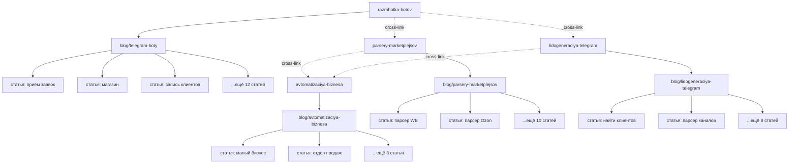

# План посадочных страниц — DimaRazrab.com

> План коммерческих и информационных страниц на основе семантического ядра.
> Дата: Август 2026

---

## 1. Коммерческие страницы (Money Pages)

### Сводная таблица

| # | URL | Кластер | Статус | Приоритет | Целевые запросы |
|---|-----|---------|--------|-----------|-----------------|
| 1 | `/razrabotka-botov` | A. Telegram-боты | ✅ Есть | ★★★ | разработка telegram бота, заказать telegram бота, telegram бот под ключ |
| 2 | `/razrabotka-servisov` | I. Веб-разработка | ✅ Есть | ★ | разработка сайта под ключ, создание сайта на заказ |
| 3 | `/razrabotka-crm` | D. Автоматизация | ✅ Есть | ★★ | разработка CRM, CRM система на заказ |
| 4 | `/avtomatizaciya-biznesа` | D. Автоматизация | ✅ Есть | ★★ | автоматизация бизнеса, автоматизация бизнес процессов |
| 5 | `/parsery-marketplejsov` | B. Парсинг | 🔲 Нужна | ★★★ | парсер wildberries, парсер ozon, мониторинг цен |
| 6 | `/lidogeneraciya-telegram` | C. Лидогенерация | 🔲 Нужна | ★★★ | поиск лидов telegram, парсер telegram, лидогенерация |
| 7 | `/razrabotka-python` | E. Python | 🔲 Нужна | ★★ | python разработчик, заказать разработку на python |
| 8 | `/razrabotka-nextjs` | F. Next.js | 🔲 Нужна | ★ | разработчик next js, next.js разработка под ключ |
| 9 | `/ai-integracii` | G. AI | 🔲 Нужна | ★ | gpt интеграция, chatgpt для бизнеса, ai агент |
| 10 | `/razrabotka-api` | H. API | 🔲 Нужна | ★ | разработка API, интеграция API, создание API на заказ |

### Итого: 4 страницы есть, 6 нужно создать.

---

## 2. Детальный план каждой коммерческой страницы

### 2.1. `/razrabotka-botov` ✅ Есть

**Статус:** Детальный лендинг с формой заявки, портфолио, кейсами, FAQ.

**Структура H1-H3:**
```
H1: Разработка Telegram-ботов на заказ
  H2: Что я предлагаю
    H3: Боты для бизнеса
    H3: Боты для магазинов
    H3: Боты для записи клиентов
  H2: Как работает процесс
    H3: Обсуждение задачи
    H3: Разработка и тестирование
    H3: Запуск и поддержка
  H2: Почему выбирают меня
    H3: Бесплатная поддержка 30 дней
    H3: Быстрые сроки
    H3: Доступные цены
  H2: Портфолио
  H2: Стоимость
  H2: FAQ
  H2: Связаться со мной
```

**Целевые запросы:** кластер A (115 запросов)
**CTA:** «Обсудить проект в Telegram» + форма заявки

**Что улучшить:**
- Добавить ссылки на hub-страницу `/blog/telegram-boty`
- Добавить блок «Полезные статьи» со ссылками на блог
- Добавить Schema.org Service
- Добавить отзывы клиентов (если есть)

---

### 2.2. `/razrabotka-servisov` ✅ Есть

**Статус:** Базовая страница.

**Рекомендуемая структура:**
```
H1: Разработка веб-сервисов и приложений на заказ
  H2: Какие сервисы я разрабатываю
    H3: SaaS-платформы
    H3: Внутренние инструменты
    H3: Дашборды и аналитика
    H3: API и интеграции
  H2: Технологический стек
    H3: Frontend: Next.js, React
    H3: Backend: Python, FastAPI, Django
    H3: Базы данных: PostgreSQL
  H2: Процесс разработки
  H2: Стоимость
  H2: Портфолио
  H2: FAQ
```

**Целевые запросы:** кластер I (частично), F (частично)
**CTA:** «Обсудить проект»

---

### 2.3. `/razrabotka-crm` ✅ Есть

**Статус:** Базовая страница.

**Рекомендуемая структура:**
```
H1: Разработка CRM-системы на заказ
  H2: Зачем нужна своя CRM
    H3: Когда стандартные CRM не подходят
    H3: Преимущества кастомной CRM
  H2: Возможности CRM
    H3: Управление клиентами
    H3: Воронка продаж
    H3: Отчёты и аналитика
    H3: Интеграция с Telegram
    H3: Интеграция с 1С
  H2: Технологии
  H2: Процесс разработки
  H2: Стоимость
  H2: Кейсы
  H2: FAQ
```

**Целевые запросы:** кластер D (CRM-запросы)
**CTA:** «Заказать CRM»

---

### 2.4. `/avtomatizaciya-biznesа` ✅ Есть

**Статус:** Детальный лендинг с формой, quiz, анимациями.

**Целевые запросы:** кластер D (85 запросов)
**CTA:** Quiz + форма заявки + Telegram

**Что улучшить:**
- Добавить ссылки на статьи кластера автоматизации
- Добавить блок кейсов

---

### 2.5. `/parsery-marketplejsov` 🔲 Нужна создать

**Целевые запросы:** кластер B (85 запросов)
**Приоритет:** ★★★ — высокий спрос, мало конкурентов

**Структура H1-H3:**
```
H1: Парсеры и автоматизация маркетплейсов — Wildberries, Ozon, Avito
  H2: Что я предлагаю
    H3: Парсинг товаров и цен
    H3: Мониторинг конкурентов
    H3: Repricer — автоматическое изменение цен
    H3: Сбор аналитики и отчётов
    H3: Управление карточками товаров
  H2: Для кого это
    H3: Селлеры Wildberries и Ozon
    H3: Продавцы на Avito
    H3: Агентства и маркетплейс-менеджеры
  H2: Как это работает
    H3: Шаг 1: Анализ задачи
    H3: Шаг 2: Разработка парсера
    H3: Шаг 3: Настройка автоматизации
    H3: Шаг 4: Запуск и поддержка
  H2: Примеры решений
    H3: Парсер цен Wildberries
    H3: Мониторинг позиций товаров
    H3: Автоматическая выгрузка в Google Sheets
    H3: Telegram-уведомления о ценах конкурентов
  H2: Технологии
    H3: Python, Selenium, BeautifulSoup
    H3: API Wildberries, Ozon
    H3: PostgreSQL, Google Sheets
  H2: Стоимость
    H3: Парсер: от 15 000 ₽
    H3: Repricer: от 30 000 ₽
    H3: Полная автоматизация: от 50 000 ₽
  H2: Почему выбирают меня
    H3: Бесплатная поддержка 30 дней
    H3: Работаю через API (легально)
    H3: Telegram-уведомления
  H2: FAQ
  H2: Связаться со мной
```

**CTA:** «Заказать парсер в Telegram» + форма

**Внутренние ссылки:**
- → `/razrabotka-botov` (Telegram-бот для мониторинга)
- → `/blog/parsery-marketplejsov` (hub-страница)
- → `/razrabotka-python` (Python-разработка)

---

### 2.6. `/lidogeneraciya-telegram` 🔲 Нужна создать

**Целевые запросы:** кластер C (65 запросов)
**Приоритет:** ★★★ — новая ниша, мало конкурентов

**Структура H1-H3:**
```
H1: Поиск лидов и клиентов в Telegram — автоматическая лидогенерация
  H2: Проблема: как найти клиентов в Telegram
    H2: Ручной поиск — долго и неэффективно
    H3: Автоматизация — быстрый результат
  H2: Что я предлагаю
    H3: Мониторинг ключевых слов в Telegram
    H3: Парсинг участников каналов и групп
    H3: Сбор контактов и username
    H3: Автоматическая рассылка
    H3: Telegram-бот для лидогенерации
  H2: Как это работает
    H3: Шаг 1: Определяем целевую аудиторию
    H3: Шаг 2: Настраиваем мониторинг
    H3: Шаг 3: Собираем и фильтруем лиды
    H3: Шаг 4: Автоматический контакт
  H2: Кейс: как собрали 500 лидов за неделю
  H2: Стоимость
    H3: Мониторинг: от 10 000 ₽
    H3: Парсинг + рассылка: от 20 000 ₽
    H3: Полная лидогенерация: от 35 000 ₽
  H2: Почему это работает
  H2: FAQ
  H2: Связаться со мной
```

**CTA:** «Заказать лидогенерацию в Telegram» + форма

**Внутренние ссылки:**
- → `/razrabotka-botов` (Telegram-бот для лидогенерации)
- → `/blog/lidogeneraciya-telegram` (hub)
- → `/avtomatizaciya-biznesа` (автоматизация отдела продаж)

---

### 2.7. `/razrabotka-python` 🔲 Нужна создать

**Целевые запросы:** кластер E (65 запросов)
**Приоритет:** ★★

**Структура H1-H3:**
```
H1: Python-разработчик на заказ — бэкенд, скрипты, автоматизация
  H2: Услуги
    H3: Backend-разработка (FastAPI, Django)
    H3: Парсинг и скрейпинг данных
    H3: Автоматизация бизнес-процессов
    H3: API-разработка
    H3: Обработка и анализ данных
  H2: Технологический стек
    H3: Python 3.10+
    H3: FastAPI, Django, Flask
    H3: PostgreSQL, Redis
    H3: Docker, Linux
  H2: Процесс работы
  H2: Портфолио
  H2: Стоимость
  H2: FAQ
```

**CTA:** «Обсудить проект в Telegram»

---

### 2.8. `/razrabotka-nextjs` 🔲 Нужна создать

**Целевые запросы:** кластер F (55 запросов)
**Приоритет:** ★

**Структура H1-H3:**
```
H1: Разработка на Next.js — веб-приложения, SaaS, лендинги
  H2: Почему Next.js
    H3: SEO-оптимизация из коробки
    H3: Высокая производительность
    H3: SSR и SSG
  H2: Что я разрабатываю
    H3: Корпоративные сайты
    H3: SaaS-платформы
    H3: Лендинги
    H3: Интернет-магазины
    H3: Дашборды
  H2: Технологии
    H3: Next.js 14+, React 18
    H3: TypeScript, Tailwind CSS
    H3: Prisma, PostgreSQL
  H2: Портфолио
  H2: Стоимость
  H2: FAQ
```

**CTA:** «Заказать сайт на Next.js»

---

### 2.9. `/ai-integracii` 🔲 Нужна создать

**Целевые запросы:** кластер G (55 запросов)
**Приоритет:** ★

**Структура H1-H3:**
```
H1: AI-интеграции для бизнеса — GPT, нейросети, AI-агенты
  H2: Что я предлагаю
    H3: Интеграция ChatGPT / OpenAI
    H3: AI-агенты для продаж и поддержки
    H3: AI-боты для Telegram
    H3: Обработка документов нейросетями
    H3: Генерация контента
  H2: Кейсы
    H3: AI-бот поддержки для интернет-магазина
    H3: Автоматическая обработка заявок
    H3: AI-ассистент для менеджеров
  H2: Технологии
    H3: OpenAI API, GPT-4
    H3: LangChain, CrewAI
    H3: Python, FastAPI
  H2: Стоимость
  H2: FAQ
```

**CTA:** «Внедрить AI в ваш бизнес»

---

### 2.10. `/razrabotka-api` 🔲 Нужна создать

**Целевые запросы:** кластер H (45 запросов)
**Приоритет:** ★

**Структура H1-H3:**
```
H1: Разработка API и интеграций — REST, GraphQL, Webhook
  H2: Услуги
    H3: REST API на Python
    H3: Интеграция с внешними сервисами
    H3: Webhook и автоматизация
    H3: Документация API
  H2: Интеграции
    H3: 1С, amoCRM, Битрикс24
    H3: Wildberries, Ozon, Avito
    H3: Платёжные системы
    H3: Google Sheets, Telegram
  H2: Технологии
  H2: Стоимость
  H2: FAQ
```

**CTA:** «Заказать API»

---

## 3. Hub-страницы блога

| # | URL | Кластер | Статус | Приоритет |
|---|-----|---------|--------|-----------|
| 1 | `/blog/telegram-boty` | A | ✅ Есть | ★★★ |
| 2 | `/blog/avtomatizaciya-biznesа` | D | ✅ Есть | ★★ |
| 3 | `/blog/parsery-marketplejsov` | B | 🔲 Нужна | ★★★ |
| 4 | `/blog/lidogeneraciya-telegram` | C | 🔲 Нужна | ★★★ |
| 5 | `/blog/python-razrabotka` | E | 🔲 Нужна | ★★ |
| 6 | `/blog/nextjs-razrabotka` | F | 🔲 Нужна | ★ |
| 7 | `/blog/ai-integracii` | G | 🔲 Нужна | ★ |
| 8 | `/blog/razrabotka-api` | H | 🔲 Нужна | ★ |
| 9 | `/blog/veb-razrabotka` | I | 🔲 Нужна | ★ |

### Итого: 2 hub-страницы есть, 7 нужно создать.

---

## 4. Информационные страницы (статьи блога)

### 4.1. Существующие статьи (20 штук)

**Кластер A: Telegram-боты (15 статей)**

| # | Slug | Целевые запросы | Статус |
|---|------|-----------------|--------|
| 1 | `priyom-zayavok` | telegram бот приём заявок | ✅ Есть |
| 2 | `internet-magazin` | telegram бот интернет магазин | ✅ Есть |
| 3 | `zapis-klientov` | telegram бот для записи клиентов | ✅ Есть |
| 4 | `python-bot` | python telegram бот разработка | ✅ Есть |
| 5 | `ai-bot` | ai бот telegram | ✅ Есть |
| 6 | `bot-dlya-biznesa` | telegram бот для бизнеса | ✅ Есть |
| 7 | `stoimost-razrabotki` | telegram бот стоимость | ✅ Есть |
| 8 | `razrabotka-pod-klyuch` | telegram бот под ключ | ✅ Есть |
| 9 | `bot-prodazhi` | telegram бот продажи | ✅ Есть |
| 10 | `ai-bot-sozdanie` | ai telegram бот создание | ✅ Есть |
| 11 | `telegram-webapp` | telegram web app разработка | ✅ Есть |
| 12 | `bot-ili-prilozhenie` | telegram бот или приложение | ✅ Есть |
| 13 | `razrabotka-s-nulya` | создание telegram бота с нуля | ✅ Есть |
| 14 | `zakazat-bota` | заказать telegram бота | ✅ Есть |
| 15 | `bot-priyom-zakazov` | telegram бот приём заказов | ✅ Есть |

**Кластер D: Автоматизация бизнеса (5 статей)**

| # | Slug | Целевые запросы | Статус |
|---|------|-----------------|--------|
| 16 | `avtomatizaciya-malogo-biznesa` | автоматизация малого бизнеса | ✅ Есть |
| 17 | `ai-avtomatizaciya-biznesa` | ai автоматизация бизнеса | ✅ Есть |
| 18 | `avtomatizaciya-otdela-prodazh` | автоматизация отдела продаж | ✅ Есть |
| 19 | `primery-avtomatizacii-biznesa` | примеры автоматизации бизнеса | ✅ Есть |
| 20 | `avtomatizaciya-biznesa-pod-klyuch` | автоматизация бизнеса под ключ | ✅ Есть |

---

### 4.2. Статьи, которые нужно создать

#### Кластер B: Парсинг маркетплейсов (12 статей)

| # | Slug | Заголовок | Целевые запросы | Приоритет | Длина |
|---|------|-----------|-----------------|-----------|-------|
| B1 | `parser-wildberries` | Парсер Wildberries: полное руководство | парсер wildberries, парсер товаров wildberries | ★★★ | 5000+ |
| B2 | `parser-ozon` | Парсер Ozon: как собрать данные о товарах | парсер ozon, парсер товаров ozon | ★★★ | 5000+ |
| B3 | `parser-avito` | Парсер Avito: сбор объявлений и контактов | парсер avito, парсер avito python | ★★★ | 5000+ |
| B4 | `monitoring-cen-marketplejsov` | Мониторинг цен на маркетплейсах: инструменты и подходы | мониторинг цен wildberries, мониторинг цен ozon | ★★★ | 4000+ |
| B5 | `repricer-wildberries` | Repricer для Wildberries: автоматическое изменение цен | repricer wildberries, repricer ozon | ★★★ | 4000+ |
| B6 | `api-wildberries-rukovodstvo` | API Wildberries: полное руководство для разработчиков | API wildberries, wildberries API python | ★★ | 5000+ |
| B7 | `api-ozon-rukovodstvo` | API Ozon: интеграция и автоматизация | API ozon, ozon API python | ★★ | 5000+ |
| B8 | `analitika-marketplejsov` | Аналитика маркетплейсов: как принимать решения на данных | анализ конкурентов wildberries, аналитика продаж | ★★ | 4000+ |
| B9 | `avtomatizaciya-postavok-wb` | Автоматизация поставок на Wildberries | автоматизация поставок wildberries | ★★ | 3500+ |
| B10 | `upravlenie-kartochkami-tovarov` | Управление карточками товаров на маркетплейсах | управление карточками товаров wildberries | ★★ | 3500+ |
| B11 | `integraciya-wb-1s` | Интеграция Wildberries с 1С: автоматизация учёта | интеграция wildberries с 1С | ★★ | 4000+ |
| B12 | `vygruzka-dannyh-wb-google-sheets` | Выгрузка данных Wildberries в Google Sheets | google sheets wildberries интеграция | ★★ | 3000+ |

**Привязка к money page:** все статьи → `/parsery-marketplejsov`

---

#### Кластер C: Лидогенерация Telegram (10 статей)

| # | Slug | Заголовок | Целевые запросы | Приоритет | Длина |
|---|------|-----------|-----------------|-----------|-------|
| C1 | `kak-najti-klientov-v-telegram` | Как найти клиентов в Telegram: полное руководство | как найти клиентов в telegram, поиск клиентов telegram | ★★★ | 5000+ |
| C2 | `parser-telegram-kanalov` | Парсер Telegram-каналов: сбор участников и контактов | парсер telegram каналов, парсер участников telegram | ★★★ | 5000+ |
| C3 | `monitoring-kluchevyh-slov-telegram` | Мониторинг ключевых слов в Telegram | мониторинг ключевых слов telegram | ★★★ | 4000+ |
| C4 | `lidogeneraciya-telegram-kak-eto-rabotaet` | Лидогенерация в Telegram: как работает автоматический поиск лидов | лидогенерация telegram, лидогенерация бот | ★★★ | 4500+ |
| C5 | `sbor-bazy-klientov-telegram` | Как собрать базу клиентов в Telegram | сбор контактов telegram, база клиентов telegram | ★★★ | 4000+ |
| C6 | `massovaya-rassylka-telegram` | Массовая рассылка в Telegram: как делать правильно | массовая рассылка telegram, автоматическая рассылка telegram | ★★ | 4000+ |
| C7 | `monitoring-chatov-telegram` | Мониторинг чатов и каналов Telegram для бизнеса | мониторинг telegram каналов, мониторинг чатов telegram | ★★ | 3500+ |
| C8 | `parser-telegram-python` | Парсер Telegram на Python: pyrogram и telethon | парсер telegram python, pyrogram парсер telegram | ★★ | 5000+ |
| C9 | `avtomaticheskij-poisk-klientov` | Автоматический поиск клиентов: инструменты и стратегии | автоматический поиск клиентов | ★★ | 4000+ |
| C10 | `lidogeneraciya-cherez-messendzhery` | Лидогенерация через мессенджеры: Telegram, WhatsApp | лидогенерация через мессенджеры | ★ | 3500+ |

**Привязка к money page:** все статьи → `/lidogeneraciya-telegram`

---

#### Кластер E: Python-разработка (8 статей)

| # | Slug | Заголовок | Целевые запросы | Приоритет | Длина |
|---|------|-----------|-----------------|-----------|-------|
| E1 | `python-razrabotka-pod-klyuch` | Python-разработка под ключ: от идеи до запуска | python разработка под ключ, python backend разработка | ★★★ | 5000+ |
| E2 | `fastapi-razrabotka` | FastAPI разработка: современный Python-фреймворк для API | fastapi разработчик, fastapi разработка | ★★★ | 4500+ |
| E3 | `python-avtomatizaciya-biznesa` | Python для автоматизации бизнеса: скрипты и инструменты | python автоматизация, python скрипты на заказ | ★★★ | 5000+ |
| E4 | `python-parsing-na-zakaz` | Python-парсинг на заказ: сбор данных с любых сайтов | python парсинг на заказ, python парсер разработка | ★★★ | 4500+ |
| E5 | `django-vs-fastapi-vs-flask` | Django vs FastAPI vs Flask: какой фреймворк выбрать | django разработчик, fastapi vs django, fastapi vs flask | ★★ | 4000+ |
| E6 | `python-backend-razrabotka` | Python backend разработка: архитектура и лучшие практики | python backend разработка, python api разработка | ★★ | 4500+ |
| E7 | `python-obrabotka-dannyh` | Python для обработки и анализа данных | python обработка данных, python анализ данных | ★ | 4000+ |
| E8 | `python-telegram-bot-razrabotka` | Разработка Telegram-бота на Python: полное руководство | python telegram бот разработка, aiogram разработка | ★★★ | 6000+ |

**Привязка к money page:** все статьи → `/razrabotka-python`

---

#### Кластер F: Next.js (5 статей)

| # | Slug | Заголовок | Целевые запросы | Приоритет | Длина |
|---|------|-----------|-----------------|-----------|-------|
| F1 | `razrabotka-na-nextjs` | Разработка на Next.js: преимущества и возможности | разработка next js, next.js разработка под ключ | ★★ | 4500+ |
| F2 | `nextjs-seo-optimizaciya` | SEO-оптимизация на Next.js: полное руководство | next.js SEO, next.js SSR | ★★ | 4000+ |
| F3 | `saas-razrabotka-nextjs` | SaaS-разработка на Next.js: архитектура и стек | SaaS разработка, next.js разработка | ★★ | 4500+ |
| F4 | `nextjs-vs-react` | Next.js vs React: когда и что использовать | next.js vs react, react разработчик | ★ | 3500+ |
| F5 | `sozdanie-sajta-nextjs` | Создание сайта на Next.js: пошаговое руководство | создание сайта на next js, next.js разработка цена | ★ | 4000+ |

**Привязка к money page:** все статьи → `/razrabotka-nextjs`

---

#### Кластер G: AI-интеграции (6 статей)

| # | Slug | Заголовок | Целевые запросы | Приоритет | Длина |
|---|------|-----------|-----------------|-----------|-------|
| G1 | `chatgpt-dlya-biznesa` | ChatGPT для бизнеса: 10 способов применения | chatgpt для бизнеса, gpt интеграция | ★★★ | 5000+ |
| G2 | `ai-agenty-dlya-biznesa` | AI-агенты для бизнеса: автоматизация на основе ИИ | ai агент разработка, ai агент для бизнеса | ★★★ | 4500+ |
| G3 | `integraciya-openai-api` | Интеграция OpenAI API: практическое руководство | интеграция openai, chatgpt api интеграция | ★★ | 4500+ |
| G4 | `ai-bot-telegram-chatgpt` | AI-бот в Telegram на базе ChatGPT | ai бот telegram, gpt бот telegram на заказ | ★★★ | 4500+ |
| G5 | `nejroseti-dlya-avtomatizacii` | Нейросети для автоматизации бизнес-процессов | нейросети для бизнеса, ai автоматизация | ★★ | 4000+ |
| G6 | `ai-dlya-obrabotki-dokumentov` | AI для обработки документов: автоматизация с помощью ИИ | ai для обработки документов | ★ | 3500+ |

**Привязка к money page:** все статьи → `/ai-integracii`

---

#### Кластер H: API-разработка (5 статей)

| # | Slug | Заголовок | Целевые запросы | Приоритет | Длина |
|---|------|-----------|-----------------|-----------|-------|
| H1 | `razrabotka-rest-api` | Разработка REST API: от проектирования до деплоя | REST API разработка, разработка API | ★★ | 4500+ |
| H2 | `integraciya-api-s-sajtom` | Интеграция API с сайтом: практические примеры | API интеграция с сайтом, интеграция API | ★★ | 4000+ |
| H3 | `webhook-integraciya` | Webhook-интеграция: автоматизация событий | webhook интеграция | ★★ | 3500+ |
| H4 | `api-integraciya-1s` | API-интеграция с 1С: обмен данными | интеграция 1С API | ★★ | 4000+ |
| H5 | `fastapi-dlya-api` | FastAPI для разработки API: почему и как | fastapi разработка api, написание API на python | ★★ | 4000+ |

**Привязка к money page:** все статьи → `/razrabotka-api`

---

#### Кластер I: Веб-разработка (4 статьи)

| # | Slug | Заголовок | Целевые запросы | Приоритет | Длина |
|---|------|-----------|-----------------|-----------|-------|
| I1 | `skolko-stoit-sozdanie-sajta` | Сколько стоит создание сайта: разбор по типам | сколько стоит создание сайта, стоимость разработки сайта | ★★ | 5000+ |
| I2 | `razrabotka-mvp` | Разработка MVP: как запустить продукт быстро | разработка MVP, создание прототипа приложения | ★★ | 4500+ |
| I3 | `uskorenie-zagruzki-sajta` | Ускорение загрузки сайта: чеклист оптимизации | оптимизация скорости сайта, ускорение загрузки сайта | ★ | 4000+ |
| I4 | `vybor-tehnologij-dlya-sajta` | Какие технологии выбрать для сайта в 2026 | fullstack разработчик, react разработчик | ★ | 4000+ |

**Привязка к money page:** все статьи → `/razrabotka-servisov`

---

## 5. Сводная статистика

### По статусу

| Тип | Есть | Нужно создать | Итого |
|-----|------|---------------|-------|
| Коммерческие страницы | 4 | 6 | 10 |
| Hub-страницы блога | 2 | 7 | 9 |
| Статьи блога | 20 | 50 | 70 |
| **ИТОГО** | **26** | **63** | **89** |

### По приоритету создания

| Приоритет | Коммерческие | Hub | Статьи | Итого |
|-----------|-------------|-----|--------|-------|
| ★★★ (немедленно) | 2 (парсинг, лидогенерация) | 2 | 20 | 24 |
| ★★ (фаза 2) | 2 (Python, CRM улучшения) | 2 | 20 | 24 |
| ★ (фаза 3) | 2 (Next.js, AI) | 3 | 10 | 15 |

---

## 6. Карта внутренней перелинковки



### Правила перелинковки:
1. Каждая статья → money page своего кластера (1-2 ссылки в тексте + CTA)
2. Каждая статья → 2-3 соседние статьи того же кластера
3. Каждая статья → 1-2 статьи другого кластера (cross-link)
4. Hub-страница → все статьи кластера + money page + 1 другой hub
5. Money page → hub-страница + 3-5 самых сильных статей

---

*Документ создан: Август 2026. Обновлять по мере создания новых страниц.*
