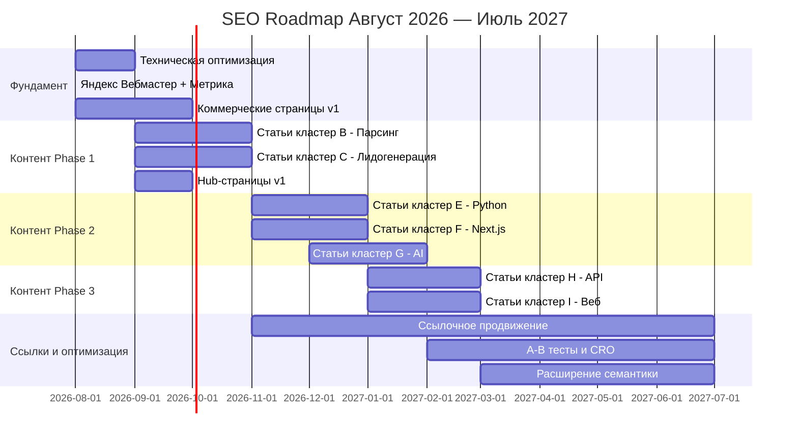

# Дорожная карта SEO на 12 месяцев — DimaRazrab.com

> Помесячный план реализации SEO-стратегии.
> Дата: Август 2026 — Июль 2027

---

## Общая схема

---

## Месяц 1: Август 2026 — Фундамент

### Цель: Заложить техническую базу

### Задачи

| # | Задача | Приоритет | Статус |
|---|--------|-----------|--------|
| 1.1 | ⚠️ robots.txt и sitemap.xml — **на бекенде** (FastAPI), не требуют фронтенд-разработки | Инфо | ✅ Бэкенд |
| 1.2 | Зарегистрировать сайт в Яндекс.Вебмастер | Критично | 🔲 |
| 1.3 | Установить Яндекс.Метрику | Критично | 🔲 |
| 1.4 | **Верифицировать семантическое ядро через Wordstat** (см. `03-ECONOMIC-MODEL.md` §9) | Критично | 🔲 |
| 1.5 | Проверить все мета-теги (title, description) | Важно | 🔲 |
| 1.6 | Проверить canonical URLs | Важно | 🔲 |
| 1.7 | Проверить Open Graph теги | Важно | 🔲 |
| 1.8 | Проверить Schema.org разметку | Важно | 🔲 |
| 1.9 | Проверить скорость загрузки (PageSpeed) | Важно | 🔲 |
| 1.10 | Проверить мобильную адаптацию | Важно | 🔲 |
| 1.11 | Создать коммерческую страницу `/parsery-marketplejsov` | Высокий | 🔲 |
| 1.12 | Создать коммерческую страницу `/lidogeneraciya-telegram` | Высокий | 🔲 |

### Ожидаемый результат
- Техническая база настроена
- 2 новые коммерческие страницы
- Сайт зарегистрирован в Яндексе
- Первые страницы начнут индексироваться

---

## Месяц 2: Сентябрь 2026 — Контентный старт

### Цель: Опубликовать первые 8-10 статей

### Задачи

| # | Задача | Приоритет | Статус |
|---|--------|-----------|--------|
| 2.1 | Написать статью B1: Парсер Wildberries | ★★★ | 🔲 |
| 2.2 | Написать статью B2: Парсер Ozon | ★★★ | 🔲 |
| 2.3 | Написать статью B3: Парсер Avito | ★★★ | 🔲 |
| 2.4 | Написать статью C1: Как найти клиентов в Telegram | ★★★ | 🔲 |
| 2.5 | Написать статью C2: Парсер Telegram-каналов | ★★★ | 🔲 |
| 2.6 | Написать статью C3: Мониторинг ключевых слов | ★★★ | 🔲 |
| 2.7 | Создать hub-страницу `/blog/parsery-marketplejsov` | ★★★ | 🔲 |
| 2.8 | Создать hub-страницу `/blog/lidogeneraciya-telegram` | ★★★ | 🔲 |
| 2.9 | Настроить внутреннюю перелинковку новых статей | Важно | 🔲 |
| 2.10 | Проверить индексацию в Яндекс.Вебмастер | Важно | 🔲 |

### Ожидаемый результат
- 6 новых статей опубликовано
- 2 hub-страницы созданы
- Начало индексации нового контента
- Первые 50-100 визитов/мес из органики

---

## Месяц 3: Октябрь 2026 — Усиление кластеров B и C

### Цель: Завершить кластеры парсинга и лидогенерации

### Задачи

| # | Задача | Приоритет | Статус |
|---|--------|-----------|--------|
| 3.1 | Написать статью B4: Мониторинг цен | ★★★ | 🔲 |
| 3.2 | Написать статью B5: Repricer Wildberries | ★★★ | 🔲 |
| 3.3 | Написать статью B6: API Wildberries | ★★ | 🔲 |
| 3.4 | Написать статью C4: Лидогенерация в Telegram | ★★★ | 🔲 |
| 3.5 | Написать статью C5: Сбор базы клиентов | ★★★ | 🔲 |
| 3.6 | Написать статью C6: Массовая рассылка | ★★ | 🔲 |
| 3.7 | Создать коммерческую страницу `/razrabotka-python` | ★★ | 🔲 |
| 3.8 | Обновить перелинковку существующих статей | Важно | 🔲 |
| 3.9 | Добавить Schema.org Service на коммерческие страницы | Важно | 🔲 |
| 3.10 | Анализ первых результатов в Яндекс.Вебмастер | Важно | 🔲 |

### Ожидаемый результат
- 6 новых статей (итого ~12 новых)
- Кластеры B и C почти завершены
- 1 новая коммерческая страница
- Первые позиции по НЧ запросам
- 100-200 визитов/мес

---

## Месяц 4: Ноябрь 2026 — Кластеры E и F

### Цель: Начать контент по Python и Next.js

### Задачи

| # | Задача | Приоритет | Статус |
|---|--------|-----------|--------|
| 4.1 | Написать статью B7: API Ozon | ★★ | 🔲 |
| 4.2 | Написать статью B8: Аналитика маркетплейсов | ★★ | 🔲 |
| 4.3 | Написать статью E1: Python-разработка под ключ | ★★★ | 🔲 |
| 4.4 | Написать статью E2: FastAPI разработка | ★★★ | 🔲 |
| 4.5 | Написать статью E3: Python для автоматизации | ★★★ | 🔲 |
| 4.6 | Написать статью F1: Разработка на Next.js | ★★ | 🔲 |
| 4.7 | Создать hub-страницу `/blog/python-razrabotka` | ★★ | 🔲 |
| 4.8 | Создать hub-страницу `/blog/nextjs-razrabotka` | ★ | 🔲 |
| 4.9 | Начать ссылочное продвижение (каталоги, профили) | Важно | 🔲 |
| 4.10 | Оптимизировать CTA на существующих страницах | Важно | 🔲 |

### Ожидаемый результат
- 6 новых статей (итого ~18 новых)
- 2 hub-страницы
- Начало ссылочного продвижения
- 200-350 визитов/мес

---

## Месяц 5: Декабрь 2026 — Расширение контента

### Цель: Усилить кластеры и начать AI-кластер

### Задачи

| # | Задача | Приоритет | Статус |
|---|--------|-----------|--------|
| 5.1 | Написать статью E4: Python-парсинг на заказ | ★★★ | 🔲 |
| 5.2 | Написать статью E8: Telegram-бот на Python | ★★★ | 🔲 |
| 5.3 | Написать статью F2: SEO на Next.js | ★★ | 🔲 |
| 5.4 | Написать статью F3: SaaS на Next.js | ★★ | 🔲 |
| 5.5 | Написать статью G1: ChatGPT для бизнеса | ★★★ | 🔲 |
| 5.6 | Написать статью G2: AI-агенты для бизнеса | ★★★ | 🔲 |
| 5.7 | Создать коммерческую страницу `/razrabotka-nextjs` | ★ | 🔲 |
| 5.8 | Создать коммерческую страницу `/ai-integracii` | ★ | 🔲 |
| 5.9 | Продолжить ссылочное продвижение | Важно | 🔲 |
| 5.10 | Анализ позиций и корректировка стратегии | Важно | 🔲 |

### Ожидаемый результат
- 6 новых статей (итого ~24 новых)
- 2 коммерческие страницы
- 250-350 визитов/мес
- Первые 2-4 заявок из органики

---

## Месяц 6: Январь 2027 — Завершение фазы 2

### Цель: Закрыть оставшиеся кластеры

### Задачи

| # | Задача | Приоритет | Статус |
|---|--------|-----------|--------|
| 6.1 | Написать статью G3: Интеграция OpenAI API | ★★ | 🔲 |
| 6.2 | Написать статью G4: AI-бот Telegram ChatGPT | ★★★ | 🔲 |
| 6.3 | Написать статью H1: Разработка REST API | ★★ | 🔲 |
| 6.4 | Написать статью H2: Интеграция API с сайтом | ★★ | 🔲 |
| 6.5 | Написать статью I1: Сколько стоит создание сайта | ★★ | 🔲 |
| 6.6 | Написать статью I2: Разработка MVP | ★★ | 🔲 |
| 6.7 | Создать hub-страницу `/blog/ai-integracii` | ★ | 🔲 |
| 6.8 | Создать hub-страницу `/blog/razrabotka-api` | ★ | 🔲 |
| 6.9 | Создать hub-страницу `/blog/veb-razrabotka` | ★ | 🔲 |
| 6.10 | Полный аудит внутренней перелинковки | Важно | 🔲 |

### Ожидаемый результат
- 6 новых статей (итого ~30 новых)
- 3 hub-страницы
- Все кластеры имеют хотя бы базовый контент
- 300-400 визитов/мес
- 3-5 заявок из органики

---

## Месяц 7: Февраль 2027 — Оптимизация

### Цель: Оптимизировать существующий контент по данным

### Задачи

| # | Задача | Приоритет | Статус |
|---|--------|-----------|--------|
| 7.1 | Анализ всех позиций в Яндекс.Вебмастер | Важно | 🔲 |
| 7.2 | Доработать статьи, которые почти в топ-10 | Важно | 🔲 |
| 7.3 | Обновить мета-теги по данным CTR | Важно | 🔲 |
| 7.4 | Добавить FAQ на коммерческие страницы | Средний | 🔲 |
| 7.5 | A/B тест CTA кнопок | Средний | 🔲 |
| 7.6 | Написать 3-4 новые статьи (длинный хвост) | Средний | 🔲 |
| 7.7 | Продолжить ссылочное продвижение | Важно | 🔲 |
| 7.8 | Добавить отзывы клиентов (если появились) | Средний | 🔲 |

### Ожидаемый результат
- Оптимизированный контент
- Улучшенные позиции по СЧ запросам
- 350-450 визитов/мес

---

## Месяц 8: Март 2027 — Масштабирование контента

### Цель: Начать расширение семантики

### Задачи

| # | Задача | Приоритет | Статус |
|---|--------|-----------|--------|
| 8.1 | Собрать дополнительные запросы (длинный хвост) | Важно | 🔲 |
| 8.2 | Написать 4-5 новых статей по НЧ запросам | Средний | 🔲 |
| 8.3 | Добавить гео-страницы (если есть спрос) | Средний | 🔲 |
| 8.4 | Создать кейс-стади (если есть проекты) | Важно | 🔲 |
| 8.5 | Обновить портфолио на коммерческих страницах | Важно | 🔲 |
| 8.6 | Продолжить ссылочное продвижение | Важно | 🔲 |
| 8.7 | Тестировать новые форматы контента | Средний | 🔲 |

### Ожидаемый результат
- Расширенная семантика
- 400-500 визитов/мес
- 5-7 заявок из органики

---

## Месяц 9: Апрель 2027 — Контент-система

### Цель: Наладить регулярный контент-процесс

### Задачи

| # | Задача | Приоритет | Статус |
|---|--------|-----------|--------|
| 9.1 | Составить контент-план на 3 месяца вперёд | Важно | 🔲 |
| 9.2 | Написать 4-6 новых статей | Средний | 🔲 |
| 9.3 | Обновить 3-5 старых статей (freshness) | Средний | 🔲 |
| 9.4 | Добавить видео-контент (если возможно) | Низкий | 🔲 |
| 9.5 | Продолжить ссылочное продвижение | Важно | 🔲 |
| 9.6 | Анализ конверсии и доработка воронки | Важно | 🔲 |

### Ожидаемый результат
- Регулярный контент-процесс
- 450-550 визитов/мес
- 5-8 заявок из органики

---

## Месяц 10: Май 2027 — Углубление

### Цель: Усилить слабые кластеры

### Задачи

| # | Задача | Приоритет | Статус |
|---|--------|-----------|--------|
| 10.1 | Проанализировать кластеры с низким трафиком | Важно | 🔲 |
| 10.2 | Написать 4-6 новых статей в слабые кластеры | Средний | 🔲 |
| 10.3 | Добавить case study по парсингу маркетплейсов | Важно | 🔲 |
| 10.4 | Добавить case study по лидогенерации | Важно | 🔲 |
| 10.5 | Продолжить ссылочное продвижение | Важно | 🔲 |
| 10.6 | Оптимизировать скорость загрузки | Средний | 🔲 |

### Ожидаемый результат
- Усиленные кластеры
- 500-600 визитов/мес
- 6-9 заявок из органики

---

## Месяц 11: Июнь 2027 — Стабилизация

### Цель: Стабилизировать поток и оптимизировать

### Задачи

| # | Задача | Приоритет | Статус |
|---|--------|-----------|--------|
| 11.1 | Полный аудит сайта | Важно | 🔲 |
| 11.2 | Обновить все даты в статьях (freshness) | Средний | 🔲 |
| 11.3 | Написать 3-4 новые статьи | Средний | 🔲 |
| 11.4 | Оптимизировать конверсию коммерческих страниц | Важно | 🔲 |
| 11.5 | Продолжить ссылочное продвижение | Важно | 🔲 |
| 11.6 | Подготовить контент-план на следующий квартал | Важно | 🔲 |

### Ожидаемый результат
- Стабильный трафик
- 550-700 визитов/мес
- 7-10 заявок из органики

---

## Месяц 12: Июль 2027 — Итоги и планирование

### Цель: Подвести итоги и спланировать следующий год

### Задачи

| # | Задача | Приоритет | Статус |
|---|--------|-----------|--------|
| 12.1 | Полный анализ SEO-результатов за год | Критично | 🔲 |
| 12.2 | ROI-анализ: затраты vs выручка от SEO | Критично | 🔲 |
| 12.3 | Обновить семантическое ядро | Важно | 🔲 |
| 12.4 | Спланировать SEO-стратегию на следующий год | Важно | 🔲 |
| 12.5 | Решить о масштабировании (найм копирайтера?) | Средний | 🔲 |
| 12.6 | Написать 3-4 новые статьи | Средний | 🔲 |

### Ожидаемый результат (к 12-му месяцу)
- 600-800 визитов/мес
- 8-12 заявок из органики
- 1-3 клиента из органики/мес
- Выручка от SEO: 60 000 - 180 000 ₽/мес

---

## Сводная таблица по месяцам

| Месяц | Статей | Комм. страниц | Hub-страниц | Трафик/мес | Заявки/мес |
|-------|--------|--------------|-------------|------------|------------|
| 1. Авг | 0 | 2 | 0 | 50-80 | 0-1 |
| 2. Сен | 6 | 0 | 2 | 80-120 | 0-1 |
| 3. Окт | 6 | 1 | 0 | 120-200 | 1-2 |
| 4. Ноя | 6 | 0 | 2 | 200-300 | 2-3 |
| 5. Дек | 6 | 2 | 0 | 250-350 | 2-4 |
| 6. Янв | 6 | 0 | 3 | 300-400 | 3-5 |
| 7. Фев | 4 | 0 | 0 | 350-450 | 4-6 |
| 8. Мар | 5 | 0 | 0 | 400-500 | 5-7 |
| 9. Апр | 5 | 0 | 0 | 450-550 | 5-8 |
| 10. Май | 5 | 0 | 0 | 500-600 | 6-9 |
| 11. Июн | 4 | 0 | 0 | 550-700 | 7-10 |
| 12. Июл | 4 | 0 | 0 | 600-800 | 8-12 |
| **ИТОГО** | **57** | **5** | **7** | | |

---

## Ключевые вехи

| Веха | Целевой месяц | Критерий успеха |
|------|--------------|-----------------|
| Верификация семантики через Wordstat | Август 2026 | Все кластеры проверены, частотности обновлены |
| Техническая готовность | Август 2026 | Вебмастер, Метрика (robots/sitemap — на бекенде) |
| Первый трафик | Сентябрь 2026 | 50+ визитов/мес из органики |
| Первая заявка из органики | Октябрь-Ноябрь 2026 | 1+ заявка/мес |
| 300 визитов/мес | Январь 2027 | Консервативный сцений выполнен |
| 3 заявки/мес | Февраль 2027 | Реалистичный сценарий (ранний) |
| 500 визитов/мес | Май 2027 | Реалистичный сценарий выполнен |
| 800 визитов/мес | Июль 2027 | Выход на стабильный поток |
| 8 заявок/мес | Июль 2027 | Окупаемость SEO |

---

## Распределение усилий по месяцам

| Деятельность | Авг | Сен | Окт | Ноя | Дек | Янв | Фев | Мар | Апр | Май | Июн | Июл |
|-------------|-----|-----|-----|-----|-----|-----|-----|-----|-----|-----|-----|-----|
| Тех. оптимизация | 80% | 10% | 5% | 5% | 5% | 5% | 5% | 5% | 5% | 5% | 5% | 5% |
| Написание контента | 0% | 60% | 60% | 60% | 60% | 50% | 30% | 40% | 40% | 40% | 30% | 20% |
| Ссылки | 0% | 0% | 10% | 15% | 15% | 20% | 20% | 20% | 20% | 20% | 20% | 20% |
| Аналитика и оптимизация | 10% | 20% | 15% | 10% | 10% | 15% | 35% | 25% | 25% | 25% | 35% | 45% |
| Стратегия | 10% | 10% | 10% | 10% | 10% | 10% | 10% | 10% | 10% | 10% | 10% | 10% |

---

*Документ создан: Август 2026. Обновлять ежемесячно по факту выполнения.*
