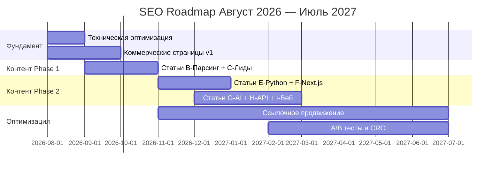

# Дорожная карта SEO на 12 месяцев — DimaRazrab.com

> Август 2026 — Июль 2027

---

## Общая схема

---

## Помесячный план

### Авг 2026 — Фундамент
| Задача | Статус |
|--------|--------|
| robots.txt + sitemap (бекенд) | ✅ |
| Регистрация в Яндекс.Вебмастер | 🔲 |
| Яндекс.Метрика | 🔲 |
| Мета-теги, OG, canonical, Schema.org | ✅ |
| Страницы `/parsery-marketplejsov`, `/lidogeneraciya-telegram` | 🔲 |

### Сен 2026 — Контентный старт
| Задача | Статус |
|--------|--------|
| Статьи B1-B3 (Парсинг WB/Ozon/Avito) | 🔲 |
| Статьи C1-C3 (Лидогенерация) | 🔲 |
| Hub: `/blog/parsery-marketplejsov`, `/blog/lidogeneraciya-telegram` | 🔲 |

### Окт 2026 — Усиление B и C
| Задача | Статус |
|--------|--------|
| Статьи B4-B6, C4-C6 | 🔲 |
| Страница `/razrabotka-python` | 🔲 |

### Ноя 2026 — Кластеры E и F
| Задача | Статус |
|--------|--------|
| Статьи B7-B8, E1-E3, F1 | 🔲 |
| Hub: `/blog/python-razrabotka`, `/blog/nextjs-razrabotka` | 🔲 |
| Начать ссылочное продвижение | 🔲 |

### Дек 2026 — Расширение
| Задача | Статус |
|--------|--------|
| Статьи E4, E8, F2-F3, G1-G2 | 🔲 |
| Страницы `/razrabotka-nextjs`, `/ai-integracii` | 🔲 |

### Янв 2027 — Завершение Phase 2
| Задача | Статус |
|--------|--------|
| Статьи G3-G4, H1-H2, I1-I2 | 🔲 |
| Hub: `/blog/ai-integracii`, `/blog/razrabotka-api`, `/blog/veb-razrabotka` | 🔲 |

### Фев-Июл 2027 — Оптимизация и рост
- Анализ позиций, доработка статей вблизи топ-10
- A/B тесты CTA, обновление мета-тегов по CTR
- Расширение семантики (длинный хвост)
- 3-6 новых статей/мес, ссылочное продвижение

---

## Сводная таблица

| Месяц | Статей | Комм. | Hub | Трафик/мес | Заявки/мес |
|-------|--------|-------|-----|------------|------------|
| Авг | 0 | 2 | 0 | 50-80 | 0-1 |
| Сен | 6 | 0 | 2 | 80-120 | 0-1 |
| Окт | 6 | 1 | 0 | 120-200 | 1-2 |
| Ноя | 6 | 0 | 2 | 200-300 | 2-3 |
| Дек | 6 | 2 | 0 | 250-350 | 2-4 |
| Янв | 6 | 0 | 3 | 300-400 | 3-5 |
| Фев | 4 | 0 | 0 | 350-450 | 4-6 |
| Мар | 5 | 0 | 0 | 400-500 | 5-7 |
| Апр | 5 | 0 | 0 | 450-550 | 5-8 |
| Май | 5 | 0 | 0 | 500-600 | 6-9 |
| Июн | 4 | 0 | 0 | 550-700 | 7-10 |
| Июл | 4 | 0 | 0 | 600-800 | 8-12 |
| **ИТОГО** | **57** | **5** | **7** | | |

---

## Ключевые вехи

| Веха | Месяц | Критерий |
|------|-------|----------|
| Техническая готовность | Авг 2026 | Вебмастер, Метрика |
| Первый трафик | Сен 2026 | 50+ визитов/мес |
| Первая заявка | Окт-Ноя 2026 | 1+ заявка/мес |
| 300 визитов/мес | Янв 2027 | Консервативный сценарий |
| 500 визитов/мес | Май 2027 | Реалистичный сценарий |
| 8 заявок/мес | Июл 2027 | Окупаемость SEO |

---

*Август 2026. Обновлять ежемесячно.*
